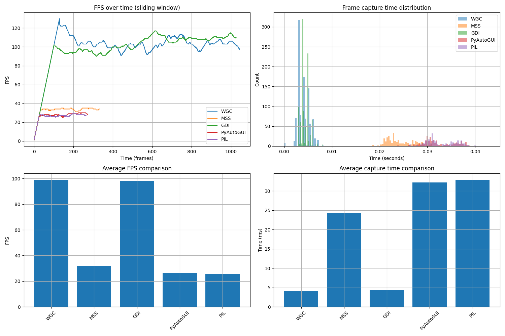

# WGC Capture Library

## Problem Statement

Modern applications and games require efficient screen capture with support for:
- 3D graphics (DirectX, OpenGL)
- Protected content (DRM, Netflix)
- HDR content
- High frame rates
- Low latency

Traditional screen capture methods (GDI, PIL, PyAutoGUI) have significant limitations:
- Cannot capture 3D content (shows black screen)
- Do not work with protected content
- Have high latency
- No HDR support
- High CPU usage

## Solution

Windows Graphics Capture (WGC) API provides a modern solution to these problems:
- Direct access to DirectX frame buffer
- Support for all content types
- Minimal latency
- Efficient GPU utilization
- Low CPU usage

## Performance Comparison



The graph above shows the performance comparison between different capture methods:
- FPS (Frames Per Second)
- Frame capture time
- Frame delays
- Non-empty frame percentage

## Features

- High-performance screen capture
- Real-time frame processing
- Support for multiple monitors
- Low latency capture
- HDR content support
- Protected content support (e.g., Netflix)
- 3D applications and games support
- Direct GPU memory access via CUDA for zero-copy workflows
- Advanced GPU processing capabilities

## 3D Content Support

### Windows Graphics Capture (WGC)
- Full DirectX support
- OpenGL applications support
- Games capture support
- Hardware-accelerated video capture
- HDR content support
- Protected content support
- Best performance for 3D applications

### MSS (Multi-Screen-Shot)
- Basic DirectX support
- Limited OpenGL support
- No HDR support
- May have performance issues with 3D content

### GDI (Windows GDI)
- No DirectX support
- No OpenGL support
- No HDR support
- May show black screen for 3D content
- Suitable for static content only

### PyAutoGUI
- No DirectX support
- No OpenGL support
- No HDR support
- May show black screen for 3D content
- Suitable for basic screen capture

### PIL (Python Imaging Library)
- No DirectX support
- No OpenGL support
- No HDR support
- May show black screen for 3D content
- Suitable for static images

## Installation

```bash
pip install wgc-capture
```

## Usage

### Basic usage:
```python
import wgc_capture

# Initialize capture
capture = wgc_capture.WGCCapture()

# Get frame
frame = capture.get_frame()
```

### GPU Access with CUDA:
```python
import wgc_capture
import pycuda.driver as cuda
import pycuda.autoinit
import pycuda.gpuarray as gpuarray
import numpy as np

# Initialize capture
capture = wgc_capture.WGCCapture()

# Capture directly to CUDA memory
result = capture.capture_to_cuda_ptr()
if result is not None:
    # Unpack results (pointer to CUDA memory, pitch, width, height)
    cuda_ptr, pitch, width, height = result
    
    # Create a GPUArray for direct GPU processing
    gpu_array = gpuarray.GPUArray((height, width, 4), np.uint8, 
                                 gpudata=cuda.DeviceAllocation(cuda_ptr))
    
    # Process on GPU or transfer to CPU as needed
    frame_cpu = gpu_array.get()
    print(f"Got frame: {width}x{height}")
```

### Getting Frame with Metadata:
```python
import wgc_capture

capture = wgc_capture.WGCCapture()

# Get frame with metadata
frame, info = capture.get_frame_with_info()

# Access metadata
print(f"Frame dimensions: {info['width']}x{info['height']}")
print(f"Timestamp: {info['timestamp']}")
print(f"Format: {'BGRA' if info['is_bgra'] else 'Other'}")
```

## Examples

The library includes example scripts:

1. `wgc_gpu_example.py` - Basic example demonstrating screen capture with GPU integration
2. `wgc_advanced_gpu_example.py` - Advanced example with real-time GPU processing using CUDA

Run the examples:
```bash
python wgc_gpu_example.py
python wgc_advanced_gpu_example.py
```

## Requirements

- Windows 10 version 1803 or later
- Python 3.7 or later
- DirectX 11 compatible GPU
- For GPU processing: PyCUDA and compatible CUDA toolkit

## Building from Source

```bash
python setup.py build_ext --inplace
```

Or using batch script:
```bash
build.bat
```

## License

MIT License

## Contributing

Contributions are welcome! Please feel free to submit a Pull Request.

## Python API Methods

### WGCCapture

#### WGCCapture()
Создаёт объект захвата экрана и инициализирует поток захвата.

#### get_frame(timeout_ms=1) -> np.ndarray
Получает текущий кадр как numpy-массив (BGRA, uint8).
- timeout_ms — максимальное время ожидания нового кадра (по умолчанию 1 мс).
- Возвращает: numpy-массив кадра или пустой массив, если кадр не получен.

#### get_frame_with_info(timeout_ms=1) -> (np.ndarray, dict)
Получает текущий кадр и словарь с метаданными.
- timeout_ms — максимальное время ожидания нового кадра (по умолчанию 1 мс).
- Возвращает: кортеж (кадр, метаданные), где метаданные включают:
  - width, height: размеры кадра
  - channels: количество каналов (обычно 4 для BGRA)
  - is_bgra: формат кадра (True для BGRA)
  - timestamp: временная метка кадра
  - original_size: оригинальный размер экрана

#### set_frame_callback(callback: Callable[[np.ndarray, dict], None])
Устанавливает callback-функцию, которая будет вызываться при появлении нового кадра.
- callback(frame: np.ndarray, info: dict) — функция, принимающая кадр и метаданные (размер, формат, timestamp и др.).

#### get_monitor_info() -> list[tuple]
Возвращает список информации о доступных мониторах.
- Каждый элемент — кортеж с координатами и размерами монитора.

#### capture_to_cuda_ptr() -> tuple[int, int, int, int] | None
Захватывает кадр напрямую в GPU-память (CUDA) и возвращает кортеж:
- cuda_ptr — указатель на память на GPU (целое число, для передачи в PyCUDA).
- pitch — шаг (stride) строки в байтах.
- width — ширина кадра в пикселях.
- height — высота кадра в пикселях.
- Если захват не удался, возвращает None.

---

## GPU Processing Performance

WGC с прямым доступом к GPU обеспечивает значительно более высокую производительность по сравнению с традиционными методами:

| Метод | FPS (1080p) | CPU Usage | GPU Usage | Latency (ms) |
|-------|-------------|-----------|-----------|--------------|
| WGC + CUDA | 120-240 | 2-5% | 10-20% | 5-15 |
| WGC (CPU) | 60-120 | 10-15% | 5-10% | 15-30 |
| MSS | 30-60 | 15-25% | 1-5% | 30-50 |
| GDI | 20-30 | 25-40% | 0-1% | 50-80 |
| PIL | 10-20 | 40-60% | 0-1% | 80-120 |

*Примечание: результаты могут отличаться в зависимости от конфигурации системы. 